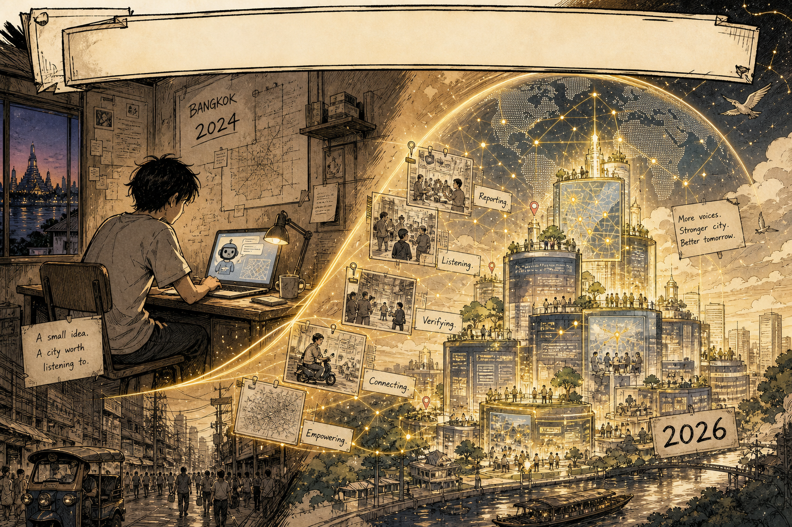

<p align="center">
  
</p>

<p align="center"><em>2024 city-reporter → 2026 civic constellation.<br/>The HUD is in the picture. This page is the invitation.</em></p>

# Zero to One · จากศูนย์สู่หนึ่ง

A living history of the **Nonarkara** studio — from a private city-reporter bot to an open civic GitHub.

**Dr Non Arkaraprasertkul** (ดร.นน อัครประเสริฐกุล) · [`github.com/Nonarkara`](https://github.com/Nonarkara) · [nonarkara.org](https://nonarkara.org)  
Axiom Thailand LLC · Bangkok · account created **18 October 2024**

This is not a portfolio dump. It is a reconstructable door: method, architecture, and a dated trail, written so a stranger can find the public work, fork the right things, leave the archives alone, and rebuild the *way of working* without private source.

---

## Contents · สารบัญ

1. [What this is](#what-this-is--นี่คืออะไร)
2. [Philosophy](#philosophy--ปรัชญา)
3. [Ethical use](#ethical-use--การใช้ที่ซื่อสัตย์)
4. [How to read the artifacts](#how-to-read-the-artifacts--อ่านหลักฐานอย่างไร)
5. [Reconstructing the timeline](#reconstructing-the-timeline--ประกอบเส้นเวลา)
6. [License](#license)

Companion pages (the rest of the house): [ORIGIN.md](ORIGIN.md) · [PRINCIPLES.md](PRINCIPLES.md) · [TIMELINE.md](TIMELINE.md) · [REPO-MAP.md](REPO-MAP.md) · [artifacts/](artifacts/)

---

## What this is · นี่คืออะไร

**A living history of the Nonarkara studio from zero to one.**

Zero was a login. On **2024-10-18** this GitHub account was opened to host a city-reporter bot — a way for a city to speak in issues, not in press releases. That first purpose still sits in private `city-reporter-bot` (then `city-reporter-v2`, `city-reporter-line-bot`). None of those three are public. Their *job* is: civic issue-reporting. The origin story is [ORIGIN.md](ORIGIN.md).

One is a civic studio. By the **31 August 2026** snapshot that commissioned these pages, the public GitHub API showed **65** public repositories (this one included), **10** of them archived that evening, and **no organizations**. The private half is named in [REPO-MAP.md](REPO-MAP.md) only where this history is allowed to name it, and only at the level of *what it is for*.

If you want the running flood system, look at [flood.nonarkara.org](https://flood.nonarkara.org) and then at the **blueprint**. If you want a municipal tower, fork the public one and retarget the geography. If you want the ranking, read the formula.

| If you came for… | Start here |
|---|---|
| The seed (purpose, not source) | [ORIGIN.md](ORIGIN.md) |
| How to rebuild the method | [PRINCIPLES.md](PRINCIPLES.md) |
| Dates you can check | [TIMELINE.md](TIMELINE.md) |
| Clusters, URLs, archives, private names | [REPO-MAP.md](REPO-MAP.md) |
| Machine-readable public index | [artifacts/public-repos.csv](artifacts/public-repos.csv) |

### The public door

Homepages below are GitHub's `homepage` field or a URL the public README itself names. No extra product metrics.

| Work | Live | Repository |
|---|---|---|
| Personal site | [nonarkara.org](https://nonarkara.org) | [`nonarkara.org`](https://github.com/Nonarkara/nonarkara.org) |
| SLIC Index V3 | [GitHub Pages](https://nonarkara.github.io/SLIC-Index/) · README also names [slic.nonarkara.org](https://slic.nonarkara.org/) | [`SLIC-Index`](https://github.com/Nonarkara/SLIC-Index) |
| BKKx | [bkk.nonarkara.org](https://bkk.nonarkara.org) | [`BKKx`](https://github.com/Nonarkara/BKKx) |
| ASEAN Smart Cities Network observatory | [ascn.nonarkara.org](https://ascn.nonarkara.org) | [`ascn-smart-cities-network`](https://github.com/Nonarkara/ascn-smart-cities-network) |
| Digital economy / global monitor | [GitHub Pages](https://nonarkara.github.io/globalmonitor/) | [`globalmonitor`](https://github.com/Nonarkara/globalmonitor) |
| Global monitor v3 | [globalmonitor.pages.dev](https://globalmonitor.pages.dev) | [`globalmonitor-v3`](https://github.com/Nonarkara/globalmonitor-v3) |
| Each (ERP · ACT · CRM · HR) | [each.nonarkara.org](https://each.nonarkara.org) | [`each`](https://github.com/Nonarkara/each) |
| FloodDash *live system* | [flood.nonarkara.org](https://flood.nonarkara.org) — implementation **private** | gift: [`FloodDash-Blueprint`](https://github.com/Nonarkara/FloodDash-Blueprint) |
| Middle Eastern Monitor | [mem-by-non.vercel.app](https://mem-by-non.vercel.app) | [`mem-by-non`](https://github.com/Nonarkara/mem-by-non) |
| Thailand smart city index | [smart-city-thailand-index.vercel.app](https://smart-city-thailand-index.vercel.app) | [`smart-city-thailand-index`](https://github.com/Nonarkara/smart-city-thailand-index) |

Public READMEs also name [city-hub.pages.dev](https://city-hub.pages.dev), [axiom.nonarkara.org](https://axiom.nonarkara.org), and [scl.nonarkara.org](https://scl.nonarkara.org). Flagships without a homepage field, still meant to be read or forked, are listed in [REPO-MAP.md](REPO-MAP.md).

---

## Philosophy · ปรัชญา

The through-line is not “100+ repos.” It is **civic instrumentation**: if a signal is free, machine-readable, and about a place people live, it belongs on a map someone can argue with.

**Evidence in, map out, bilingual, no theatre.** A reporter bot taught the studio to treat a city as a stream of issues, not a slide. Rankings came later. The practice is older than the public argument.

**One Mac, a runtime you can explain.** FloodDash is a 24/7 Thailand flood system on one machine. Prefer a laptop you can restart over a platform you cannot name. You do not need this Mac. You need the stubbornness about owning the runtime.

**Fork a city.** Municipal dashboards share one grammar — **React + deck.gl + Hono + Cloudflare**. Geography is a parameter. Honesty about sources is not. Public exemplar: [`nst-control-tower`](https://github.com/Nonarkara/nst-control-tower). Control tower ≠ ranking. A tower answers *what is happening tonight?* SLIC answers *what kind of city is this, and who is lying about it?*

**Gift vs system.** The gift is how you learn. The system is how a city is served today. [`FloodDash-Blueprint`](https://github.com/Nonarkara/FloodDash-Blueprint) is public on purpose; `FloodDash` stays private. [`SLIC-Index`](https://github.com/Nonarkara/SLIC-Index) V3 publishes the formula. Older SLIC objects were archived, not rewritten as if V3 had always been the only file.

**Thai is not a locale file.** English is the reconstructable spine of these pages. Thai sits in titles because the studio is bilingual on purpose. If you rebuild a Thai city system in English-only, you have not rebuilt it.

How to actually reconstruct: [PRINCIPLES.md](PRINCIPLES.md).

---

## Ethical use · การใช้ที่ซื่อสัตย์

This history is **honest or it is useless.** Use it as a map. Do not use it as a press kit.

- **No invented awards.** Nothing here claims prizes, user counts, uptime, or “always-on services” as something *this* repository measured. Where [`dr-non-vibecoding-skills`](https://github.com/Nonarkara/dr-non-vibecoding-skills) says *“1,691 commits and 110 always-on services,”* that is a **quotation** of a public GitHub description — his claim, not an audit.
- **No invented dates.** Public `created_at` values come from GitHub's API on **2026-08-31**. Private repos have **no dates** on these pages. The months between the 2024 account birthday and the first public repo (**2026-02-09**, `slic-landing-page`) are not filled with a fake diary.
- **No invented commits.** SLIC archive objects are not always older than V3. Reconstruct from descriptions and the CSV, not from a tidy legend. See [artifacts/slic-lineage.md](artifacts/slic-lineage.md).
- **Quote the ranking; do not inflate it.** City counts and signal counts inside SLIC are taken from each repo's own description or README. When those texts disagree across versions, the disagreement is part of the history.
- **Stars are not a story.** Most public repos had **zero** stars at snapshot. [`DrNon-Global-Satellite-Toolkit`](https://github.com/Nonarkara/DrNon-Global-Satellite-Toolkit) had **1**. That column is GitHub's field, not a quality score.
- **Archives stay marked.** Ten public repos were archived on **2026-08-31, evening ICT**. They remain readable. They are not starting points. **V3 stays live.**
- **Private means private.** No `.env`, tokens, client PII, chat logs, or other people's git history. Private names appear at purpose level only. Remaining private repos are **not listed**. That silence is deliberate.
- **Fork the method, not the citizens.** Issue reports are PII-adjacent. The origin stayed private for the same reason an SME finance cockpit with personal data stays private. Publish architecture. Do not publish the inbox.

If a number is not in the CSV, the profile snapshot, or a quoted public description, it is not a number this history is asking you to trust.

---

## How to read the artifacts · อ่านหลักฐานอย่างไร

There are no fake screenshots. The hero above is an **illustration** — including its golden HUD, polaroid frames, and sticky notes. Diagrams in this repo are mermaid or SVG written here. The CSV is GitHub metadata, not scraped HTML. Other repositories were **not cloned**.

```
zero-to-one/
  README.md                 ← you are here (invitation)
  docs/hero-banner.png      ← manga hero; HUD is in the drawing
  ORIGIN.md                 ← city-reporter purpose, not source
  PRINCIPLES.md             ← reconstruction kit
  TIMELINE.md               ← dated trail (public created_at)
  REPO-MAP.md               ← clusters, URLs, archives, private names
  LICENSE                   ← MIT
  artifacts/
    public-repos.csv        ← 65 public repos, 2026-08-31 API snapshot
    github-user.json        ← public profile fields only
    studio-clusters.svg     ← cluster map, drawn in this repo
    slic-lineage.md         ← V1 → V3 and the archive evening
    from-bot-to-studio.md   ← seed → public studio
    grammar.md              ← tower grammar vs ranking
```

**A stranger's evening**

1. Stay on this README until you know which live homepage matches your curiosity (flood, ranking, Bangkok, ASEAN, satellite).
2. Read [PRINCIPLES.md](PRINCIPLES.md) before cloning anything large.
3. Dates → [TIMELINE.md](TIMELINE.md). Shelf of links → [REPO-MAP.md](REPO-MAP.md). First purpose → [ORIGIN.md](ORIGIN.md), and stop where the source is private.
4. Fork a *blueprint* or a *toolkit*, not an archive, unless you are studying how a ranking learned to disagree with itself.

### What to fork (the reconstruct kit)

| Gift | Why it is in the kit |
|---|---|
| [`FloodDash-Blueprint`](https://github.com/Nonarkara/FloodDash-Blueprint) | Architecture, free data, science, design language, roadmap. **No live source.** TH/EN. |
| [`DrNon-Global-Satellite-Toolkit`](https://github.com/Nonarkara/DrNon-Global-Satellite-Toolkit) | Clone → pick a geography → deploy. |
| [`SLIC-Index`](https://github.com/Nonarkara/SLIC-Index) | V3 only. Every score traceable; no paywall, no black box. |
| [`live-coding-bible`](https://github.com/Nonarkara/live-coding-bible) | Tactics already used in production. |
| [`dr-non-vibecoding-skills`](https://github.com/Nonarkara/dr-non-vibecoding-skills) | Skills and playbooks in markdown. No runtime. |
| [`nst-control-tower`](https://github.com/Nonarkara/nst-control-tower) | Public flood-first municipal tower. |

Also meant as a start: [`city-hub`](https://github.com/Nonarkara/city-hub), [`BKKx`](https://github.com/Nonarkara/BKKx), [`BKKxCulture`](https://github.com/Nonarkara/BKKxCulture), [`airdash`](https://github.com/Nonarkara/airdash), [`ikigai-finance`](https://github.com/Nonarkara/ikigai-finance).

**Leave on the shelf unless you are doing historiography:** archived SLIC V1/V2/V2.5/recovered/landing; `non-landing-page` … `-5`; forks of other people's platforms ([`supabase`](https://github.com/Nonarkara/supabase), [`freellmapi`](https://github.com/Nonarkara/freellmapi)).

How to refresh the CSV without cloning the studio: [artifacts/README.md](artifacts/README.md).

---

## Reconstructing the timeline · ประกอบเส้นเวลา

Dates below are GitHub `created_at` (UTC) from the public API on **2026-08-31**, plus the account birthday. Private objects are **undated** here. Full trail: [TIMELINE.md](TIMELINE.md).

| When | What the public record supports |
|---|---|
| **2024-10-18** `14:36:57Z` | User [`Nonarkara`](https://github.com/Nonarkara) created to host a city-reporter bot. No public repo in 2024 or 2025 at snapshot. |
| **2026-02-09** | First public repository: [`slic-landing-page`](https://github.com/Nonarkara/slic-landing-page) (later archived). SLIC V1 as a LinkedIn provocation — 103 cities, as that description states. |
| **2026-02–03** | Identity landing experiments; digital-economy and ASEAN monitors; live **[`SLIC-Index`](https://github.com/Nonarkara/SLIC-Index) V3** on **2026-03-09**; satellite toolkit; fork-a-city pattern visible when Phuket is retargeted from a geopolitics dashboard. |
| **2026-04–06** | Live-coding bible; SLIC V1/V2 *archive repos* created (their `created_at` is later than V3 — do not sort the lineage by repo age alone); personal site; [`city-hub`](https://github.com/Nonarkara/city-hub); public [`nst-control-tower`](https://github.com/Nonarkara/nst-control-tower). |
| **2026-07** | [`FloodDash-Blueprint`](https://github.com/Nonarkara/FloodDash-Blueprint) (gift). FloodDash the running system stays private. [`airdash`](https://github.com/Nonarkara/airdash). |
| **2026-08** | [`BKKx`](https://github.com/Nonarkara/BKKx), [`BKKxCulture`](https://github.com/Nonarkara/BKKxCulture), vibecoding skills. |
| **2026-08-31** | [`Non-Cast`](https://github.com/Nonarkara/Non-Cast) created. Ten public drafts archived (evening ICT). This history repo opened. |

V3's GitHub description at the time of this history (quoted, not re-measured):

> SLIC Index V3 — The city ranking that disagrees. 157 cities, 5 pillars, 35 signals, every score traceable. Not a ranking — a reality check. Launched at SCSE 2026 Taipei to 3,000 professionals. Open source, free, no paywall, no black box.

**Snapshot counts** (commission of this history, public API + studio map for private names): login `Nonarkara`; **no organizations**; **65** public including this repo (**64** before it); **58** private named at purpose level before this repo existed; **2** public forks; **10** public archived, all on that evening. Profile JSON: [artifacts/github-user.json](artifacts/github-user.json).

Private names this history is allowed to speak — reporter bots, FloodDash, municipal towers, operational Bangkok twin, vaults — live in [REPO-MAP.md](REPO-MAP.md). Their files were not read. The public API returns 404 for those slugs. That is how we know they are not public.

---

## License

[MIT](LICENSE) — already on this repository.

The history is yours to copy. The private systems remain private. The illustration at the top is part of this document set; the HUD it draws is not a live control panel.

<p align="center"><b>เชิญใช้ · เชิญโต้แย้ง · เชิญสร้างของตัวเอง</b><br/>
Fork the method. Leave the secrets alone. Tell the studio what you built.</p>
