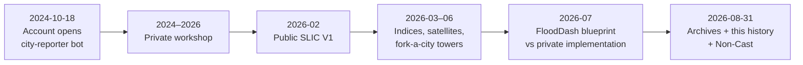

# zero-to-one

## จากศูนย์สู่หนึ่ง — a reconstructable history of this GitHub studio

**An invitation, not a pitch.** This repository is the public memory of [Dr Non Arkaraprasertkul](https://github.com/Nonarkara) ([@Nonarkara](https://github.com/Nonarkara)): urbanist turned systems builder, [Axiom Thailand LLC](https://github.com/Nonarkara/Axiom), Bangkok.

The GitHub account was created on **18 October 2024**, originally to host a city-reporter bot. By **31 August 2026** it is a civic studio of **about 122 repositories** (64 public, 58 private, including two public forks — counted before *this* repo existed). A stranger should be able to open this page and leave knowing:

1. how the account grew,
2. which public work to fork,
3. which repositories are archives,
4. how to reconstruct the *method* without private source code.

Site · [nonarkara.org](https://nonarkara.org)  
GitHub · [github.com/Nonarkara](https://github.com/Nonarkara)  
License · [MIT](LICENSE) (this repo)

---

## Contents · สารบัญ

| Document | What it is for |
|---|---|
| **[README.md](README.md)** (this file) | The story, the live links, where to start |
| **[TIMELINE.md](TIMELINE.md)** | Dated trail — GitHub `created_at` for every public repo |
| **[REPO-MAP.md](REPO-MAP.md)** | Clusters, URLs, archives, private names at purpose-level only |
| **[ORIGIN.md](ORIGIN.md)** | The city-reporter lineage that opened the account |
| **[PRINCIPLES.md](PRINCIPLES.md)** | How to reconstruct the work from public blueprints |
| **[artifacts/](artifacts/)** | CSV of public repos, mermaid/SVG maps this repo wrote |

Nothing here copies another repository's git history, binaries, `.env` files, tokens, or client PII. Private repos are **named and described by purpose**, never by internals.

---

## Who · ใคร

GitHub login **Nonarkara**. No organizations. Bio, as published on the profile:

> Urbanist turned systems builder: Harvard–MIT–Oxford trained. Government AI and smart city strategist by day, experimental builder by night.

The studio's public thesis, quoted from the [Axiom](https://github.com/Nonarkara/Axiom) landing-page repo:

> Most "smart city" work ends as a deck. Ours runs in production.

And from [live-coding-bible](https://github.com/Nonarkara/live-coding-bible), the signature move:

> show different data sources on the same axis to reveal correlations that nobody thought to look for.

---

## The story, in one sitting

**October 2024.** A GitHub user appears. Its first job is not a portfolio. It is a **city reporter** — a bot meant to make a city legible as a daily brief. That origin remains private ([ORIGIN.md](ORIGIN.md)). For more than a year the account is a workshop, not a shop window.

**February–March 2026.** The window opens. The first public repository is a SLIC landing page: a transparent city ranking published as a provocation. Within weeks there is a Digital Economy dashboard, an ASEAN Smart Cities Network observatory, and a live SLIC index. The ranking's own joke becomes a method: *every city ranking is a lie — here is ours, with the formula showing*.

**March–July 2026.** The studio learns to **fork a city**. A satellite toolkit you can point at any geography. A Bangkok operating system. A flood-first municipal control tower for Nakhon Si Thammarat, published so other towns can steal the pattern. FloodDash itself stays private; its ideas are given away as [FloodDash-Blueprint](https://github.com/Nonarkara/FloodDash-Blueprint) — *พิมพ์เขียว ไม่ใช่ซอร์สโค้ด*. The one-Mac thesis is stated in public: production dashboards, not lab demos, hanging off one machine and one domain.

**August 2026.** Bangkok, block by block: a playable atlas and a heritage twin. Skills and playbooks distilled so a future agent (or a future person) can ship the same way. On 31 August 2026 the SLIC V1/V2 line and the early personal landing pages are archived. SLIC V3 stays live. The same day this history repo is born — and so is [Non-Cast](https://github.com/Nonarkara/Non-Cast), still empty at audit time.

The through-line is not "100+ repos." It is **civic instrumentation**: if a signal is free, machine-readable, and about a place people live, it belongs on a map someone can argue with.

---

## Live public work · ของที่เปิดให้เข้าไปใช้

Homepages as published on GitHub (or, where the listing is empty, as stated in that repo's own public README). Do not treat star counts as a quality signal — almost every listing here has zero stars; that is a fact of the snapshot, not a ranking.

| Work | Live | Repository |
|---|---|---|
| Personal site | [nonarkara.org](https://nonarkara.org) | [nonarkara.org](https://github.com/Nonarkara/nonarkara.org) |
| SLIC Index V3 | [nonarkara.github.io/SLIC-Index](https://nonarkara.github.io/SLIC-Index/) | [SLIC-Index](https://github.com/Nonarkara/SLIC-Index) |
| BKKx — Bangkok, block by block | [bkk.nonarkara.org](https://bkk.nonarkara.org) | [BKKx](https://github.com/Nonarkara/BKKx) |
| ASCN Progress Observatory | [ascn.nonarkara.org](https://ascn.nonarkara.org) | [ascn-smart-cities-network](https://github.com/Nonarkara/ascn-smart-cities-network) |
| Digital Economy dashboard | [nonarkara.github.io/globalmonitor](https://nonarkara.github.io/globalmonitor/) | [globalmonitor](https://github.com/Nonarkara/globalmonitor) |
| Global monitor v3 | [globalmonitor.pages.dev](https://globalmonitor.pages.dev) | [globalmonitor-v3](https://github.com/Nonarkara/globalmonitor-v3) |
| Each (ERP · ACT · CRM · HR) | [each.nonarkara.org](https://each.nonarkara.org) | [each](https://github.com/Nonarkara/each) |
| FloodDash (implementation **private**) | [flood.nonarkara.org](https://flood.nonarkara.org) | Blueprint: [FloodDash-Blueprint](https://github.com/Nonarkara/FloodDash-Blueprint) |
| Middle Eastern Monitor | [mem-by-non.vercel.app](https://mem-by-non.vercel.app) | [mem-by-non](https://github.com/Nonarkara/mem-by-non) |
| Thailand smart city index | [smart-city-thailand-index.vercel.app](https://smart-city-thailand-index.vercel.app) | [smart-city-thailand-index](https://github.com/Nonarkara/smart-city-thailand-index) |
| City Hub | [city-hub.pages.dev](https://city-hub.pages.dev) | [city-hub](https://github.com/Nonarkara/city-hub) |
| Axiom landing | [axiom.nonarkara.org](https://axiom.nonarkara.org) | [Axiom](https://github.com/Nonarkara/Axiom) |
| BKKx operational twin | [atlas.nonarkara.org](https://atlas.nonarkara.org) | Private: `bkk-3d-atlas` (named in [BKKxCulture](https://github.com/Nonarkara/BKKxCulture)) |

---

## Fork these first · ชุดที่ให้เริ่มสร้างต่อ

If you want the **method**, not a client system, start here. These are the public reconstruction kit.

| Repo | Why it is in the kit | Created |
|---|---|---|
| [FloodDash-Blueprint](https://github.com/Nonarkara/FloodDash-Blueprint) | Architecture, free data, science, design language, roadmap. **No source code.** Bilingual TH/EN. | 2026-07-04 |
| [DrNon-Global-Satellite-Toolkit](https://github.com/Nonarkara/DrNon-Global-Satellite-Toolkit) | "Clone → pick your geography → deploy." Satellite-powered dashboards as a framework. | 2026-03-20 |
| [SLIC-Index](https://github.com/Nonarkara/SLIC-Index) | V3 live ranking: every score traceable; no paywall, no black box. | 2026-03-09 |
| [live-coding-bible](https://github.com/Nonarkara/live-coding-bible) | Recurring tactics for data-heavy dashboards with AI. | 2026-04-09 |
| [dr-non-vibecoding-skills](https://github.com/Nonarkara/dr-non-vibecoding-skills) | 31 skills + 10 playbooks, plain markdown, no runtime. | 2026-08-13 |
| [nst-control-tower](https://github.com/Nonarkara/nst-control-tower) | Public "fork-a-city" municipal tower, flood-first. | 2026-06-22 |
| [city-hub](https://github.com/Nonarkara/city-hub) | Bangkok smart-city OS, built independent of any single platform. | 2026-05-26 |
| [offline-ai-coding](https://github.com/Nonarkara/offline-ai-coding) | One-command local AI coding stack. | 2026-04-11 |
| [dr-non-agentic-ai-council](https://github.com/Nonarkara/dr-non-agentic-ai-council) | The one-Mac council: divide and conquer, no supercomputer. | 2026-05-09 |

How to use them as a set is in **[PRINCIPLES.md](PRINCIPLES.md)**.

---

## Archives · สิ่งที่เก็บแล้ว

On **31 August 2026 (ICT)** these were archived. They remain readable. They are not the live line.

**SLIC lineage** — V3 at [Nonarkara/SLIC-Index](https://github.com/Nonarkara/SLIC-Index) stays live.

- [slic-landing-page](https://github.com/Nonarkara/slic-landing-page) — V1 provocation (103 cities)
- [SLIC-Index-V1](https://github.com/Nonarkara/SLIC-Index-V1) — V1 static ranking archive
- [SLIC-Index-V2](https://github.com/Nonarkara/SLIC-Index-V2) — V2 archive
- [SLIC-Index-V2.5](https://github.com/Nonarkara/SLIC-Index-V2.5) — V2/V2.5 interactive line
- [slic-index-v1-recovered](https://github.com/Nonarkara/slic-index-v1-recovered) — V1 recovered from the 9 March 2026 build

**Early personal landings**

- [non-landing-page](https://github.com/Nonarkara/non-landing-page) through [non-landing-page-5](https://github.com/Nonarkara/non-landing-page-5)

Full dated trail: **[TIMELINE.md](TIMELINE.md)**. Visual lineage: [artifacts/slic-lineage.mmd](artifacts/slic-lineage.mmd).

---

## What stays private · สิ่งที่ไม่เปิดซอร์ส

Private repositories **may be named**. They may not be opened. Purpose-level only — see **[REPO-MAP.md](REPO-MAP.md)** for the notable list.

Typical reasons something stays private here: a running municipal or client system, an operational digital twin, a vault of working memory, the original city-reporter bots, or an implementation whose *ideas* were already gifted as a blueprint.

The pattern to copy is public. The production wiring of a particular city often is not.

---

## Snapshot facts (do not inflate)

Verified from GitHub's public API on **31 August 2026**, plus the studio map for private names:

| Fact | Value |
|---|---|
| Login | `Nonarkara` |
| Account created | `2024-10-18T14:36:57Z` |
| Organizations | none |
| Public repos (including this one) | 65 |
| Public before this repo | 64 |
| Private (studio map, before this repo) | 58 |
| Public forks | 2 — [supabase](https://github.com/Nonarkara/supabase), [freellmapi](https://github.com/Nonarkara/freellmapi) |
| Public archived | 10 (all marked archived 2026-08-31) |
| Public stars worth recording | [DrNon-Global-Satellite-Toolkit](https://github.com/Nonarkara/DrNon-Global-Satellite-Toolkit) has **1** star; the rest of the public set is at 0 in this snapshot |

City-count and signal-count claims inside SLIC are **quoted from each repo's own description or README**, not re-measured here. When those texts disagree across versions, the disagreement is part of the history.

Machine-readable public index: [artifacts/public-repos.csv](artifacts/public-repos.csv).

---

## Studio map

A cluster view of the public surface (and the private names that explain it) lives in **[REPO-MAP.md](REPO-MAP.md)** and as a drawing this repo wrote:

---

## How to read this as a stranger

1. Skim this README once. Follow one live homepage that matches your curiosity (flood, ranking, Bangkok, ASEAN, satellite).
2. Read **[PRINCIPLES.md](PRINCIPLES.md)** before cloning anything large.
3. If you want dates, open **[TIMELINE.md](TIMELINE.md)**. If you want a shelf of links, open **[REPO-MAP.md](REPO-MAP.md)**.
4. If you want the first purpose of the account, open **[ORIGIN.md](ORIGIN.md)** — and stop where the source is private.
5. Fork a *blueprint* or a *toolkit*, not an archive, unless you are studying how a ranking learned to disagree with itself.

---

<b>เชิญใช้ · เชิญโต้แย้ง · เชิญสร้างของตัวเอง</b> 
Fork the method. Leave the secrets alone. Tell the studio what you built.

