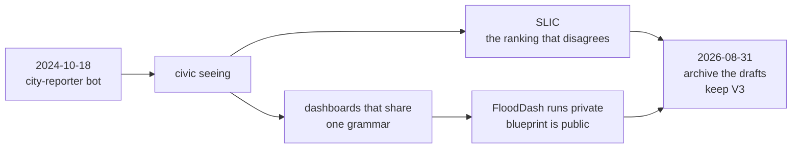

# Zero to One · จากศูนย์สู่หนึ่ง

How a city-reporter bot became an open civic studio.

**Dr Non Arkaraprasertkul** (ดร.นน อัครประเสริฐกุล) · GitHub [`Nonarkara`](https://github.com/Nonarkara) · [nonarkara.org](https://nonarkara.org)  
Axiom Thailand LLC · Bangkok · account created **2024-10-18**

This repository is a reconstructable history of that account. It is an invitation: method, architecture, and timeline, written so a stranger can find the public work, fork the right things, leave the archives alone, and rebuild the *way of working* without ever needing private source.

---

## Contents · สารบัญ

1. [An invitation](#an-invitation--คำเชิญ)
2. [The short version](#the-short-version)
3. [Live public work](#live-public-work--งานที่เปิดอยู่)
4. [The story](#the-story--จากบอทสู่สตูดิโอ)
5. [What to fork](#what-to-fork--fork-เหล่านี้)
6. [Archives](#archives--คลังที่ปิดแล้ว)
7. [Private work, named only](#private-work-named-only)
8. [This document set](#this-document-set)
9. [How these pages were compiled](#how-these-pages-were-compiled)
10. [License](#license)

Companion pages:

| Page | What it holds |
|---|---|
| [TIMELINE.md](TIMELINE.md) | Dated trail. Public `created_at` from GitHub. |
| [REPO-MAP.md](REPO-MAP.md) | Clusters, URLs, archived flags, private names at purpose level. |
| [ORIGIN.md](ORIGIN.md) | The city reporter: how civic issue-reporting seeded the studio. |
| [PRINCIPLES.md](PRINCIPLES.md) | How a future reader reconstructs the method. |
| [artifacts/](artifacts/) | CSV of public repos, SVG map, mermaid diagrams. |

---

## An invitation · คำเชิญ

I opened this GitHub account on **18 October 2024** to host a city-reporter bot. I am an urbanist who learned to build systems. By day I work on government AI and smart-city strategy; by night I ship. There are no GitHub organizations under this login — everything hangs off one person, one Mac, one domain family.

By **31 August 2026** the account was a civic studio of a little over a hundred repositories. The public half is here for you. The private half is named in [REPO-MAP.md](REPO-MAP.md) only where this history is allowed to name it, and only at the level of *what it is for*.

I do not dump client files, `.env` contents, tokens, or private source into a memoir. If you want the running flood system, look at the live site and then at the **blueprint**. If you want a municipal tower, fork the public one and retarget the geography. If you want the ranking, read the formula.

---

## The short version



- **Origin.** Private `city-reporter-bot`, then `city-reporter-v2` and `city-reporter-line-bot`. Issue-reporting taught the studio to treat a city as a stream of evidence, not a slide.
- **Grammar.** Many municipal dashboards share **React + deck.gl + Hono + Cloudflare**. The public exemplar is [`nst-control-tower`](https://github.com/Nonarkara/nst-control-tower).
- **Disagreement.** [`SLIC-Index`](https://github.com/Nonarkara/SLIC-Index) is the public ranking that refuses a black box. Older SLIC objects were **archived on 2026-08-31**.
- **Gift vs system.** [`FloodDash-Blueprint`](https://github.com/Nonarkara/FloodDash-Blueprint) is the gift. `FloodDash` (private) is the 24/7 Thailand system on one Mac. Live: [flood.nonarkara.org](https://flood.nonarkara.org).
- **Method, in public.** [`live-coding-bible`](https://github.com/Nonarkara/live-coding-bible), [`dr-non-vibecoding-skills`](https://github.com/Nonarkara/dr-non-vibecoding-skills), [`DrNon-Global-Satellite-Toolkit`](https://github.com/Nonarkara/DrNon-Global-Satellite-Toolkit).

---

## Live public work · งานที่เปิดอยู่

Homepages below are either GitHub's `homepage` field or a URL the public README itself names. I am not inventing extra product metrics.

| Work | Repo | Live |
|---|---|---|
| Personal site | [`nonarkara.org`](https://github.com/Nonarkara/nonarkara.org) | [nonarkara.org](https://nonarkara.org) |
| SLIC Index V3 | [`SLIC-Index`](https://github.com/Nonarkara/SLIC-Index) | [GitHub Pages](https://nonarkara.github.io/SLIC-Index/) · README also names [slic.nonarkara.org](https://slic.nonarkara.org/) |
| BKKx | [`BKKx`](https://github.com/Nonarkara/BKKx) | [bkk.nonarkara.org](https://bkk.nonarkara.org) |
| ASEAN Smart Cities Network observatory | [`ascn-smart-cities-network`](https://github.com/Nonarkara/ascn-smart-cities-network) | [ascn.nonarkara.org](https://ascn.nonarkara.org) |
| Digital economy / global monitor | [`globalmonitor`](https://github.com/Nonarkara/globalmonitor) | [GitHub Pages](https://nonarkara.github.io/globalmonitor/) |
| Global monitor v3 | [`globalmonitor-v3`](https://github.com/Nonarkara/globalmonitor-v3) | [globalmonitor.pages.dev](https://globalmonitor.pages.dev) |
| Each (ERP · ACT · CRM · HR) | [`each`](https://github.com/Nonarkara/each) | [each.nonarkara.org](https://each.nonarkara.org) |
| FloodDash *live system* | implementation is **private** | [flood.nonarkara.org](https://flood.nonarkara.org) — read [`FloodDash-Blueprint`](https://github.com/Nonarkara/FloodDash-Blueprint) |
| Middle Eastern Monitor | [`mem-by-non`](https://github.com/Nonarkara/mem-by-non) | [mem-by-non.vercel.app](https://mem-by-non.vercel.app) |
| Thailand smart city index | [`smart-city-thailand-index`](https://github.com/Nonarkara/smart-city-thailand-index) | [smart-city-thailand-index.vercel.app](https://smart-city-thailand-index.vercel.app) |

Public flagships without a `homepage` field, still meant to be read or forked: [`DrNon-Global-Satellite-Toolkit`](https://github.com/Nonarkara/DrNon-Global-Satellite-Toolkit), [`FloodDash-Blueprint`](https://github.com/Nonarkara/FloodDash-Blueprint), [`BKKxCulture`](https://github.com/Nonarkara/BKKxCulture), [`nst-control-tower`](https://github.com/Nonarkara/nst-control-tower), [`airdash`](https://github.com/Nonarkara/airdash), [`city-hub`](https://github.com/Nonarkara/city-hub), [`live-coding-bible`](https://github.com/Nonarkara/live-coding-bible), [`dr-non-vibecoding-skills`](https://github.com/Nonarkara/dr-non-vibecoding-skills), [`ikigai-finance`](https://github.com/Nonarkara/ikigai-finance), [`Axiom`](https://github.com/Nonarkara/Axiom), the NON·ISM press set ([`100-days-of-solitude`](https://github.com/Nonarkara/100-days-of-solitude), [`100daysofnon`](https://github.com/Nonarkara/100daysofnon), [`slowdown`](https://github.com/Nonarkara/slowdown), [`ninja-innovation`](https://github.com/Nonarkara/ninja-innovation), [`mean`](https://github.com/Nonarkara/mean)), and [`Non-Cast`](https://github.com/Nonarkara/Non-Cast) (created 2026-08-31).

The public README of [`city-hub`](https://github.com/Nonarkara/city-hub) names [city-hub.pages.dev](https://city-hub.pages.dev). The public README of [`Axiom`](https://github.com/Nonarkara/Axiom) names [axiom.nonarkara.org](https://axiom.nonarkara.org). The public README of [`scl-landing-page`](https://github.com/Nonarkara/scl-landing-page) names [scl.nonarkara.org](https://scl.nonarkara.org).

---

## The story · จากบอทสู่สตูดิโอ

**Zero.** In October 2024 there was no studio. There was a login, created to host a reporter: a way for a city to speak in issues, not in press releases. That first purpose still sits in a private repository named `city-reporter-bot`. It grew a v2 and a LINE bot. None of those three are public. Their *job* is public knowledge: civic issue-reporting. That habit — evidence in, map out, bilingual, no theatre — is the seed. The full origin is in [ORIGIN.md](ORIGIN.md).

**The long private interval.** The first *public* repository on this account appears on **2026-02-09** (`slic-landing-page`). I do not invent a diary for the months in between. What became visible in 2026 is a ranking, then a fleet of dashboards, then a practice of publishing the method.

**The ranking that disagrees.** SLIC started as a LinkedIn provocation (the landing page's own GitHub description: 103 cities, ranked transparently). V3 lives in [`SLIC-Index`](https://github.com/Nonarkara/SLIC-Index), created **2026-03-09**. GitHub's description at the time of this history:

> SLIC Index V3 — The city ranking that disagrees. 157 cities, 5 pillars, 35 signals, every score traceable. Not a ranking — a reality check. Launched at SCSE 2026 Taipei to 3,000 professionals. Open source, free, no paywall, no black box.

V1, V2, V2.5, a recovered V1, and the landing page were **archived on 2026-08-31, evening ICT**. V3 stays live. Dates and the slightly messy `created_at` order (archive repos are not always older than V3) are in [TIMELINE.md](TIMELINE.md).

**Fork a city.** Once the dashboard grammar existed, geography became a parameter. Nakhon Si Thammarat is public. Other municipal towers are private (Chula, Yala, KMITL, Praram 9, Lopburi, Sikhio, Chonburi — purpose-level names from the studio map). Bangkok has a public operating-system sketch ([`city-hub`](https://github.com/Nonarkara/city-hub)), a playable/cultural atlas ([`BKKx`](https://github.com/Nonarkara/BKKx), [`BKKxCulture`](https://github.com/Nonarkara/BKKxCulture)), and a private operational twin (`bkk-3d-atlas`).

**One Mac, public safety.** FloodDash is the running 24/7 Thailand flood system. The source stays private. The architecture, free data catalog, science, design language, and roadmap were published as [`FloodDash-Blueprint`](https://github.com/Nonarkara/FloodDash-Blueprint) so another team can equal or beat it. Air quality has a public cousin: [`airdash`](https://github.com/Nonarkara/airdash). Satellite-powered dashboards have a public kit: [`DrNon-Global-Satellite-Toolkit`](https://github.com/Nonarkara/DrNon-Global-Satellite-Toolkit).

**The studio learns in public.** [`live-coding-bible`](https://github.com/Nonarkara/live-coding-bible) is how data-heavy dashboards get built with AI. [`dr-non-vibecoding-skills`](https://github.com/Nonarkara/dr-non-vibecoding-skills) is the skill pack. Its GitHub description — *his claim, not a measurement made in this repo* — reads:

> 31 skills + 10 playbooks, distilled from 1,691 commits and 110 always-on services. The system I use every day to ship real software alone with AI agents — memory ladder, deploy discipline, design DNA, 3D city maps, local AI + voice cloning. Plain markdown, no runtime; loads in Claude Code, Antigravity, Codex, Cursor, Gemini CLI, Aider, OpenCode.

**One.** On 2026-08-31 the studio archived ten public drafts, opened [`Non-Cast`](https://github.com/Nonarkara/Non-Cast) (a fork-this podcast kit), and opened this history. The account is no longer a bot hostel. It is a civic studio with a public door.

---

## What to fork · fork เหล่านี้

If you are a stranger with an evening:

1. **Method** — [`live-coding-bible`](https://github.com/Nonarkara/live-coding-bible) then [`dr-non-vibecoding-skills`](https://github.com/Nonarkara/dr-non-vibecoding-skills).
2. **A city ranking without a black box** — [`SLIC-Index`](https://github.com/Nonarkara/SLIC-Index) (V3 only).
3. **A municipal control tower** — [`nst-control-tower`](https://github.com/Nonarkara/nst-control-tower). Change the geography; keep the honesty about sources.
4. **Flood intelligence** — [`FloodDash-Blueprint`](https://github.com/Nonarkara/FloodDash-Blueprint). Do not wait for the private repo.
5. **Satellite dashboards** — [`DrNon-Global-Satellite-Toolkit`](https://github.com/Nonarkara/DrNon-Global-Satellite-Toolkit).
6. **A finance cockpit you can actually run** — [`ikigai-finance`](https://github.com/Nonarkara/ikigai-finance) (the OSS slice; the SME dashboard with PII-adjacent data stays private).
7. **Bangkok, block by block** — [`BKKx`](https://github.com/Nonarkara/BKKx) and [`BKKxCulture`](https://github.com/Nonarkara/BKKxCulture).

Principles for that reconstruction: [PRINCIPLES.md](PRINCIPLES.md).

---

## Archives · คลังที่ปิดแล้ว

Until the evening of **2026-08-31 ICT**, this account had **zero** archived public repos. That evening these ten were archived (GitHub `updated_at` clustered around `2026-08-31T12:58Z`, which is 19:58 ICT):

- [`SLIC-Index-V1`](https://github.com/Nonarkara/SLIC-Index-V1)
- [`SLIC-Index-V2`](https://github.com/Nonarkara/SLIC-Index-V2)
- [`SLIC-Index-V2.5`](https://github.com/Nonarkara/SLIC-Index-V2.5)
- [`slic-index-v1-recovered`](https://github.com/Nonarkara/slic-index-v1-recovered)
- [`slic-landing-page`](https://github.com/Nonarkara/slic-landing-page)
- [`non-landing-page`](https://github.com/Nonarkara/non-landing-page) … [`non-landing-page-5`](https://github.com/Nonarkara/non-landing-page-5)

They remain public, marked archived. They are history, not starting points. **V3 stays live.**

---

## Private work, named only

The studio map that commissioned this history allows these private names, each with one line of purpose — not internals:

| Name | Purpose |
|---|---|
| `city-reporter-bot` | The origin. Civic issue-reporting bot; first reason this account exists. |
| `city-reporter-v2` | Second generation of the reporter. |
| `city-reporter-line-bot` | LINE-channel reporter. |
| `FloodDash` | 24/7 Thailand flood system, one Mac. |
| `airdnd-platform` | Bangkok spa / civic map. |
| `ikigai-dashboard` | SME finance cockpit (PII-adjacent — that is why it is private). |
| `hcmc-dashboard` | Ho Chi Minh City dashboard. |
| `bkk-3d-atlas` | Operational Bangkok digital twin (sibling of public BKKx). |
| Control towers: chula, yala, kmitl, praram9, lopburi, sikhio, chonburi | Municipal dashboards sharing the public grammar. |
| `Ekkasarn-AI` | Named in the studio map; purpose not expanded beyond the name. |
| `rag-nonarkara` | Named in the studio map (retrieval store). |
| `locating-shanghai` | Routledge monograph workspace. |
| `axiom-ops` | Studio operations, including a podcast pipeline. |
| `second-brain-vault` | Private vault beside the public `second-brain-os`. |

A full cluster map, including every public URL: [REPO-MAP.md](REPO-MAP.md). Remaining private repos are **not listed**. That silence is deliberate.

---

## This document set

```
zero-to-one/
  README.md          ← you are here
  TIMELINE.md
  REPO-MAP.md
  ORIGIN.md
  PRINCIPLES.md
  LICENSE            ← MIT
  artifacts/
    public-repos.csv
    github-user.json
    studio-clusters.svg
    slic-lineage.md
    from-bot-to-studio.md
    grammar.md
```

There are no fake screenshots. Diagrams are mermaid or SVG written in this repo. The CSV is GitHub metadata, not scraped HTML.

---

## How these pages were compiled

- **Public facts** from GitHub's public API (`users/Nonarkara`, `users/Nonarkara/repos`) on **2026-08-31**. Fields used: `created_at`, `description`, `html_url`, `homepage`, `archived`, `fork`, `language`, `stargazers_count`.
- **Private names and purposes** only from the map that commissioned this history. Those slugs return **404** on the public API, which is how we know they are not public. Their files were not read. Other repositories were **not cloned**.
- **Counts at audit, before this repo existed:** about **122** repositories — **64** public, **58** private, **2** forks ([`supabase`](https://github.com/Nonarkara/supabase), [`freellmapi`](https://github.com/Nonarkara/freellmapi)), **0** archived until that evening. After `zero-to-one` landed, the public API showed **65** public repositories (this one included). Login `Nonarkara` (same as `nonarkara`). **No organizations.**
- I do not claim user counts, uptime, or “110 always-on services” as something I measured. Where that phrase appears, it is a **quotation** of a public GitHub description.
- `Non-Cast` was created **2026-08-31T12:23:00Z**. The audit that commissioned this history recorded it as still empty (README-only). A later same-day public API read showed a Python kit whose description is: *“Fork this, add your corpus, get a daily podcast. Agent-agnostic.”*

If a number is not in the CSV, the profile snapshot, or a quoted public description, it is not a number I am asking you to trust.

---

## License

[MIT](LICENSE) — already on this repository. The history is yours to copy. The private systems remain private.
