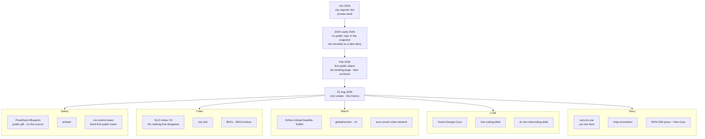

# Start here · เริ่มที่นี่

The learner’s front door to this supercodebase.

The [README](README.md) is the invitation. This page is the **teaching path**: who the history is for, how the studio grew, which six public repositories to read in order, how to fork without stealing secrets, and where the diagrams live.

MIT. No invented dates. No private source. The HUD in the [hero](docs/hero-banner.png) is illustration only.

---

## 1 · Who this history is for

Three readers. Same house. Different doors.

| You are… | You came to… | Do this |
|---|---|---|
| **Visitor** | Understand what Nonarkara *is* without cloning anything | Stay on this page through the mermaid. Open one live homepage from the [README](README.md) (flood, ranking, Bangkok, ASEAN). Stop. |
| **Builder** | Rebuild the *way of working* on a geography you actually know | Walk the [six-repo path](#3--recommended-learning-path) below. Then [PRINCIPLES.md](PRINCIPLES.md). Then fork a *blueprint* or *toolkit*, not an archive. |
| **City practitioner** | Serve a place tonight — flood, air, ranking, a municipal map | Read [`FloodDash-Blueprint`](https://github.com/Nonarkara/FloodDash-Blueprint) and [`SLIC-Index`](https://github.com/Nonarkara/SLIC-Index) V3. Label modelled numbers as modelled. Do not wait for an RFP, and do not treat any of this as an official product of a government, a vendor, or this studio. |

The origin of the account is a **private** city-reporter bot. The public GitHub API returns 404 for `city-reporter-bot`, `city-reporter-v2`, and `city-reporter-line-bot`. Their *job* is public knowledge: civic issue-reporting. Their files are not in this history. Purpose, not source: [ORIGIN.md](ORIGIN.md).

---

## 2 · Studio evolution · จากผู้สื่อข่าวสู่ที่ดินสาธารณะ

Account created **2024-10-18** to host a city-reporter. The first *public* repository appears **2026-02-09**. This history does not invent a diary for the months in between. The civic estate below is the **public surface** as of the **2026-08-31** snapshot — five teaching clusters, not a vendor catalogue. Private names appear only where [REPO-MAP.md](REPO-MAP.md) already names them, and only at purpose level.

**How to read the clusters**

| Cluster | What it teaches | Public exemplars already in this history |
|---|---|---|
| **Safety** | Operations before commentary. Gift vs running system. | [`FloodDash-Blueprint`](https://github.com/Nonarkara/FloodDash-Blueprint) (public); `FloodDash` stays private; [`airdash`](https://github.com/Nonarkara/airdash); [`nst-control-tower`](https://github.com/Nonarkara/nst-control-tower) |
| **Cities** | Geography is a parameter. Rankings publish the formula. | [`SLIC-Index`](https://github.com/Nonarkara/SLIC-Index) V3; [`city-hub`](https://github.com/Nonarkara/city-hub); [`BKKx`](https://github.com/Nonarkara/BKKx) |
| **Watch** | Unlike open signals on one axis. Clone → pick a geography. | [`DrNon-Global-Satellite-Toolkit`](https://github.com/Nonarkara/DrNon-Global-Satellite-Toolkit); [`globalmonitor`](https://github.com/Nonarkara/globalmonitor); [`ascn-smart-cities-network`](https://github.com/Nonarkara/ascn-smart-cities-network) |
| **Craft** | How the studio actually ships: design DNA, dashboard tactics, agent skills. | [`Axiom-Design-Core`](https://github.com/Nonarkara/Axiom-Design-Core); [`live-coding-bible`](https://github.com/Nonarkara/live-coding-bible); [`dr-non-vibecoding-skills`](https://github.com/Nonarkara/dr-non-vibecoding-skills) |
| **Story** | Why a public servant would bother. History you can reconstruct. | This repo; [`ninja-innovation`](https://github.com/Nonarkara/ninja-innovation); [`Non-Cast`](https://github.com/Nonarkara/Non-Cast) |

A denser lineage (private names included at purpose level) is [`artifacts/from-bot-to-studio.md`](artifacts/from-bot-to-studio.md). Full shelf: [REPO-MAP.md](REPO-MAP.md).

---

## 3 · Recommended learning path

Pedagogical order, **not** chronological order. Each `created_at` below is GitHub’s public field from the 2026-08-31 CSV. Walk them in this sequence even though SLIC is older than the blueprint.

| Step | Repo | Created | What you learn |
|---|---|---|---|
| 1 | **This repo** [`zero-to-one`](https://github.com/Nonarkara/zero-to-one) | 2026-08-31 | How to read a civic studio without private source. You are here. Next: [README](README.md) once, then keep walking. |
| 2 | [`FloodDash-Blueprint`](https://github.com/Nonarkara/FloodDash-Blueprint) | 2026-07-04 | Architecture, free data, science, design language, build-your-own roadmap. **No source of the live system.** TH/EN. Live implementation stays private at [flood.nonarkara.org](https://flood.nonarkara.org). |
| 3 | [`SLIC-Index`](https://github.com/Nonarkara/SLIC-Index) | 2026-03-09 | V3 only — the ranking that disagrees. Every score traceable. Fork V3, not the archives. Live: [GitHub Pages](https://nonarkara.github.io/SLIC-Index/). |
| 4 | [`DrNon-Global-Satellite-Toolkit`](https://github.com/Nonarkara/DrNon-Global-Satellite-Toolkit) | 2026-03-20 | Clone → pick your geography → deploy. Satellite-powered dashboards as a framework. |
| 5 | [`Axiom-Design-Core`](https://github.com/Nonarkara/Axiom-Design-Core) | 2026-06-26 | Living design system for Axiom decision systems. How the studio wants interfaces to feel. |
| 6 | [`ninja-innovation`](https://github.com/Nonarkara/ninja-innovation) | 2026-05-08 | The story that makes the method humane: a public servant replacing million-dollar platforms with curiosity and public data. |

After step 6, if you will actually build: [PRINCIPLES.md](PRINCIPLES.md), then fork [`nst-control-tower`](https://github.com/Nonarkara/nst-control-tower) **or** the satellite toolkit, pointed at **one** place you know, with **two** unlike open sources on the same map.

---

## 4 · How to fork ethically

Fork the **method**. Leave the **secrets** alone.

- **Method, not secrets.** Blueprints, formulas, design cores, and public towers are the gift. `.env` files, tokens, client PII, chat logs, and private implementations are not. `FloodDash` the 24/7 system is private; [`FloodDash-Blueprint`](https://github.com/Nonarkara/FloodDash-Blueprint) is the gift. Issue-reporting inboxes stay closed for the same reason.
- **Measured vs modelled.** If a number cannot be walked backwards to a source and a weight, it does not ship. Label modelled layers as modelled. SLIC’s public argument is the opposite of a black box. Do not republish a rank, a flood watch score, or an air-quality “cigarette equivalent” as if it were a sensor.
- **Not official products.** These repositories are a studio’s public work — MIT-licensed ideas and code — not a Thai government product, not a municipal procurement, not Axiom-as-vendor delivering a certified system, and not an endorsement of whatever you build next. Keep our name off the badge unless the work is actually ours.
- **Archives are historiography.** SLIC V1/V2/V2.5/recovered/landing and `non-landing-page` … `-5` were archived **2026-08-31**. Readable. Not starting points.
- **Stars are not a story.** Most public repos had zero at snapshot. That is GitHub’s field, not a quality score.

The long form of this ethic: [README — Ethical use](README.md#ethical-use--การใช้ที่ซื่อสัตย์) and [PRINCIPLES.md](PRINCIPLES.md).

---

## 5 · Where diagrams and reconstruct artifacts live

Everything that reconstructs the studio **without cloning other git histories** is in this repository.

| Artifact | What it is |
|---|---|
| This page | Teaching mermaid: Oct 2024 seed → 2026 estate (Safety, Cities, Watch, Craft, Story) |
| [`docs/hero-banner.png`](docs/hero-banner.png) | Manga hero. HUD is **in the drawing**, not a live overlay. |
| [`artifacts/from-bot-to-studio.md`](artifacts/from-bot-to-studio.md) | Mermaid: reporter seed → public studio (private names at purpose level) |
| [`artifacts/grammar.md`](artifacts/grammar.md) | Mermaid: municipal grammar vs the ranking that disagrees |
| [`artifacts/slic-lineage.md`](artifacts/slic-lineage.md) | Mermaid: SLIC V1 → V3 and the archive evening |
| [`artifacts/studio-clusters.svg`](artifacts/studio-clusters.svg) | Hand-drawn cluster map |
| [`artifacts/public-repos.csv`](artifacts/public-repos.csv) | 65 public repos, GitHub API **2026-08-31** |
| [`artifacts/github-user.json`](artifacts/github-user.json) | Public profile fields only |
| [`TIMELINE.md`](TIMELINE.md) | Dated trail. Public `created_at` only. Private repos undated. |
| [`REPO-MAP.md`](REPO-MAP.md) | Clusters, URLs, archives, private names at purpose level |
| [`ORIGIN.md`](ORIGIN.md) | Why the login exists |
| [`PRINCIPLES.md`](PRINCIPLES.md) | How to reconstruct without private source |

How to refresh the CSV without cloning the studio: [`artifacts/README.md`](artifacts/README.md).

---

## License

[MIT](LICENSE) — already on this repository.

The path is yours to copy. The private systems remain private.

<b>เชิญเรียน · เชิญโต้แย้ง · เชิญสร้างของตัวเอง</b> 
Learn the method. Leave the secrets alone. Tell the studio what you built.

