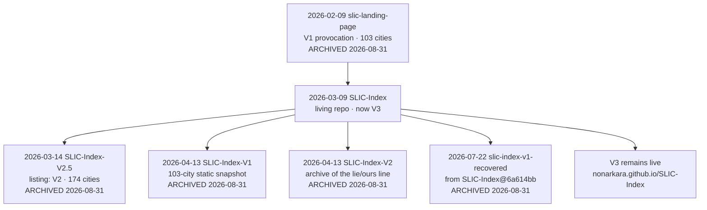

# TIMELINE

## เส้นเวลา — dated trail of the Nonarkara studio

Every **public** date below is GitHub `created_at` (UTC) from the public API, snapshotted **31 August 2026**. Private dates are not available from that API; private entries are placed from the studio map and from public statements those private works left behind (homepages, sibling READMEs). They are marked **private**.

Do not treat `created_at` as "first idea" or "first production deploy." It is when the repository object appeared.

Account: [Nonarkara](https://github.com/Nonarkara) · `created_at` **2024-10-18T14:36:57Z** · no orgs.

---

## 2024-10-18 — the account exists because a city needed a reporter

GitHub user **Nonarkara** is created. The first purpose of the account is a **city-reporter bot** (private). That is the zero. The public studio is the one that grew from it.

See **[ORIGIN.md](ORIGIN.md)** for the lineage (`city-reporter-bot` → `city-reporter-v2` → `city-reporter-line-bot`). No public `created_at` exists for those three.

For the rest of 2024 and all of 2025 the public listing is empty. The workshop is private. This gap is part of the history, not a missing citation.

---

## 2026-02 — the window opens (SLIC V1, landings, first dashboards)

The first public repository is a SLIC landing page. Its own description calls V1 "the original provocation," first published on LinkedIn, "103 cities ranked transparently for the first time."

| Date (UTC) | Repository | Notes |
|---|---|---|
| 2026-02-09 | [slic-landing-page](https://github.com/Nonarkara/slic-landing-page) **archived 2026-08-31** | SLIC Index V1 landing. Homepage at archive time: `https://slic-index.onrender.com` |
| 2026-02-10 | [asean-csco-app](https://github.com/Nonarkara/asean-csco-app) | Public; listing has no description |
| 2026-02-24 | [non-landing-page](https://github.com/Nonarkara/non-landing-page) **archived 2026-08-31** | "NON — city systems designer, anthropologist, novelist" |
| 2026-02-24 | [non-landing-page-2](https://github.com/Nonarkara/non-landing-page-2) **archived 2026-08-31** | "editorial minimalist landing page" |
| 2026-02-24 | [non-landing-page-3](https://github.com/Nonarkara/non-landing-page-3) **archived 2026-08-31** | "Non Landing Page 3" |
| 2026-02-25 | [non-landing-page-4](https://github.com/Nonarkara/non-landing-page-4) **archived 2026-08-31** | "City systems designer. Anthropologist. Novelist." |
| 2026-02-26 | [non-landing-page-5](https://github.com/Nonarkara/non-landing-page-5) **archived 2026-08-31** | No description on the listing |
| 2026-02-27 | [globalmonitor](https://github.com/Nonarkara/globalmonitor) | "Dr Non's Digital Economy Dashboard by depa" · live [nonarkara.github.io/globalmonitor](https://nonarkara.github.io/globalmonitor/) |
| 2026-02-28 | [smart-city-thailand-monitor](https://github.com/Nonarkara/smart-city-thailand-monitor) | "Smart City Thailand public monitor dashboard prototype" |

---

## 2026-03 — indices, networks, the satellite kit, Axiom

SLIC-Index is created **9 March 2026**. The repository *name* later holds **V3**; a later archive recovers V1 from this repo's 9 March build (`slic-index-v1-recovered`, citing commit `6a614bb`). Read the lineage as a single living repo that outgrew its first model, plus snapshot repos around it — not as five independent products.

| Date (UTC) | Repository | Notes |
|---|---|---|
| 2026-03-04 | [solomon-islands-workshop](https://github.com/Nonarkara/solomon-islands-workshop) | "Strategic Workshop Report: Digitalizing Solomon Islands – UN DESA × Government of Solomon Islands, December 2025" |
| 2026-03-05 | [ascnofficial](https://github.com/Nonarkara/ascnofficial) | Public; listing has no description |
| 2026-03-05 | [ascn-smart-cities-network](https://github.com/Nonarkara/ascn-smart-cities-network) | "ASCN V2 Progress Observatory" · live [ascn.nonarkara.org](https://ascn.nonarkara.org) |
| 2026-03-05 | [techhuntthailand](https://github.com/Nonarkara/techhuntthailand) | "Smart City Thailand Tech Hunt trilingual showcase directory" |
| 2026-03-08 | [scl-landing-page](https://github.com/Nonarkara/scl-landing-page) | Public; listing has no description |
| 2026-03-08 | [RAAT](https://github.com/Nonarkara/RAAT) | "The Royal Automobile Association of Thailand" |
| 2026-03-08 | [dr-non-operating-systems](https://github.com/Nonarkara/dr-non-operating-systems) | Public; listing has no description |
| 2026-03-08 | [phuket-smart-bus](https://github.com/Nonarkara/phuket-smart-bus) | "Phuket Smart Bus rider prototype" |
| 2026-03-09 | [SLIC-Index](https://github.com/Nonarkara/SLIC-Index) **live V3** | Listing: "SLIC Index V3 — The city ranking that disagrees. 157 cities, 5 pillars, 35 signals, every score traceable… Launched at SCSE 2026 Taipei to 3,000 professionals." Live [nonarkara.github.io/SLIC-Index](https://nonarkara.github.io/SLIC-Index/) |
| 2026-03-11 | [geopolitics-dashboard](https://github.com/Nonarkara/geopolitics-dashboard) | Public; listing has no description |
| 2026-03-12 | [phuket-dashboard](https://github.com/Nonarkara/phuket-dashboard) | Public; listing has no description |
| 2026-03-14 | [SLIC-Index-V2.5](https://github.com/Nonarkara/SLIC-Index-V2.5) **archived 2026-08-31** | Listing calls it "SLIC Index V2" — "174 cities, 53 countries. Interactive spider diagram… The version European mayors asked to use instead of The Economist's index." |
| 2026-03-15 | [Axiom](https://github.com/Nonarkara/Axiom) | "Axiom — Innovation as a Service. AI consultancy landing page." README points at [axiom.nonarkara.org](https://axiom.nonarkara.org) |
| 2026-03-20 | [DrNon-Global-Satellite-Toolkit](https://github.com/Nonarkara/DrNon-Global-Satellite-Toolkit) | Open-source satellite dashboard framework. **1 star** in this snapshot (the only public Nonarkara repo with a non-zero star count here) |
| 2026-03-26 | [non69](https://github.com/Nonarkara/non69) | "Thailand Watch Intelligence Dashboard. Satellite overlays, Claude-powered analysis, civic signals." |
| 2026-03-26 | [Non-Claude-Skills](https://github.com/Nonarkara/Non-Claude-Skills) | "Dr-Non-Stack: Complete Claude Code skill — design system, database strategy, SEO pipeline, 60+ free APIs, satellite data, news pipeline" |

---

## 2026-04 — Thailand index, monitors, the live-coding bible, SLIC snapshots

| Date (UTC) | Repository | Notes |
|---|---|---|
| 2026-04-01 | [smart-city-thailand-index](https://github.com/Nonarkara/smart-city-thailand-index) | "Thailand smart city index — measuring reality, not paper plans. Built on SLIC methodology." Live [smart-city-thailand-index.vercel.app](https://smart-city-thailand-index.vercel.app) |
| 2026-04-03 | [mem-by-non](https://github.com/Nonarkara/mem-by-non) | "Middle Eastern Monitor (MEM)" · live [mem-by-non.vercel.app](https://mem-by-non.vercel.app) |
| 2026-04-07 | [middleeast-monitor](https://github.com/Nonarkara/middleeast-monitor) | "Middle East War Monitor — real-time conflict tracker with PMUA, depa, Axiom" |
| 2026-04-09 | [live-coding-bible](https://github.com/Nonarkara/live-coding-bible) | "How Dr. Non builds data-heavy dashboards with AI — The Live Coding Bible" |
| 2026-04-11 | [kuching-ioc](https://github.com/Nonarkara/kuching-ioc) | "Daniel's Goh Greater Kuching Intelligent Operation Center — Smart City Dashboard" |
| 2026-04-11 | [offline-ai-coding](https://github.com/Nonarkara/offline-ai-coding) | "Stop paying for tokens. Code with AI offline. One command setup." |
| 2026-04-13 | [SLIC-Index-V1](https://github.com/Nonarkara/SLIC-Index-V1) **archived 2026-08-31** | "Original 103-city static ranking (archive)" |
| 2026-04-13 | [SLIC-Index-V2](https://github.com/Nonarkara/SLIC-Index-V2) **archived 2026-08-31** | "Every city ranking is a lie. Here's ours. (archive)" |

---

## 2026-05 — second brain, press, one-Mac council, City Hub

| Date (UTC) | Repository | Notes |
|---|---|---|
| 2026-05-02 | [second-brain-os](https://github.com/Nonarkara/second-brain-os) | "A personal operating system built on Obsidian, Claude Code, and a council of three AI siblings — Hannah, Radar, Tenet." Private sibling: `second-brain-vault` |
| 2026-05-04 | [council-watch](https://github.com/Nonarkara/council-watch) | "Council health backstop — pings M3 every 5 min" |
| 2026-05-07 | [sciti](https://github.com/Nonarkara/sciti) | Public; listing has no description |
| 2026-05-08 | [nonarkara.org](https://github.com/Nonarkara/nonarkara.org) | Personal site source · live [nonarkara.org](https://nonarkara.org) |
| 2026-05-08 | [100-days-of-solitude](https://github.com/Nonarkara/100-days-of-solitude) | "Interactive ebook with butterfly page-flip. NON·ISM PRESS." |
| 2026-05-08 | [ninja-innovation](https://github.com/Nonarkara/ninja-innovation) | "How a public servant replaces million-dollar platforms with curiosity and public data." |
| 2026-05-08 | [slowdown](https://github.com/Nonarkara/slowdown) | "The Things You Can See Only When You Slow Down — an interactive art ebook" |
| 2026-05-08 | [mean](https://github.com/Nonarkara/mean) | "A small dictionary… 100 words across three languages." |
| 2026-05-09 | [dr-non-agentic-ai-council](https://github.com/Nonarkara/dr-non-agentic-ai-council) | "A 9-bot AI council… runs on a Mac, costs ~$0-25/month. Divide and conquer, no supercomputer." |
| 2026-05-24 | [100daysofnon](https://github.com/Nonarkara/100daysofnon) | "100-day biographical installation. One question per day, publicly fact-checked." |
| 2026-05-26 | [city-hub](https://github.com/Nonarkara/city-hub) | "Bangkok smart-city operating system — live PM2.5, satellite imagery, civic alerts, AI narratives." README live URL: [city-hub.pages.dev](https://city-hub.pages.dev) |

---

## 2026-06 — geopolitics v3, the public control tower, design cores, Each

This is the month the **fork-a-city** pattern becomes explicit in public: Nakhon Si Thammarat's flood-first municipal tower is published as source others can take.

| Date (UTC) | Repository | Notes |
|---|---|---|
| 2026-06-01 | [horizon](https://github.com/Nonarkara/horizon) | Public; listing has no description |
| 2026-06-19 | [globalmonitor-v3](https://github.com/Nonarkara/globalmonitor-v3) | "Global Political Dashboard v3" · live [globalmonitor.pages.dev](https://globalmonitor.pages.dev) |
| 2026-06-22 | [nst-control-tower](https://github.com/Nonarkara/nst-control-tower) | "Nakhon Si Thammarat Smart City Dashboard — flood-first municipal control tower (React + deck.gl + Hono)" |
| 2026-06-26 | [ikigai-finance-engine](https://github.com/Nonarkara/ikigai-finance-engine) | "SME finance intelligence research — screenshots, architecture, finance indices (development stage)" |
| 2026-06-26 | [Axiom-Design-Core](https://github.com/Nonarkara/Axiom-Design-Core) | "living design system for Axiom decision systems. Rams × Moggridge × Norman × MoMA × Maeda × Vignelli." |
| 2026-06-26 | [Rams-NYCTA-Design-Core](https://github.com/Nonarkara/Rams-NYCTA-Design-Core) | "Dieter Rams × Noorda/Vignelli. Three-layer interface standard" |
| 2026-06-27 | [each](https://github.com/Nonarkara/each) | "Each — ERP · ACT · CRM · HR for the startup." · live [each.nonarkara.org](https://each.nonarkara.org) |

**Private control-tower family** (no public `created_at`; named only): Chulalongkorn, Yala, KMITL, Praram 9, Lopburi, Sikhio, Chonburi — municipal or campus towers in the same family as the public NST repo. Also private: `hcmc-dashboard` (Ho Chi Minh City dashboard), `FloodDash` (Thailand flood-monitoring implementation), `ikigai-dashboard`.

---

## 2026-07 — blueprint vs implementation, forks, air watch, V1 recovered

| Date (UTC) | Repository | Notes |
|---|---|---|
| 2026-07-04 | [FloodDash-Blueprint](https://github.com/Nonarkara/FloodDash-Blueprint) | "Open invitation: the ideas behind FloodDash… No source code. Bilingual TH/EN." Live system (private implementation): [flood.nonarkara.org](https://flood.nonarkara.org) |
| 2026-07-04 | [freellmapi](https://github.com/Nonarkara/freellmapi) **fork** | Upstream experiment: free-tier LLM proxy. "Personal experimentation only." |
| 2026-07-04 | [supabase](https://github.com/Nonarkara/supabase) **fork** | Upstream Postgres platform. The studio's only two public forks. |
| 2026-07-15 | [luma-house](https://github.com/Nonarkara/luma-house) | "gesture-first home design prototype with concept renders" |
| 2026-07-16 | [airdash](https://github.com/Nonarkara/airdash) | "AirDash — 24/7 air quality & PM2.5 watch for Thailand" |
| 2026-07-22 | [slic-index-v1-recovered](https://github.com/Nonarkara/slic-index-v1-recovered) **archived 2026-08-31** | "100-city preview, one declared formula, zero black boxes. Recovered from the March 9, 2026 build (SLIC-Index commit 6a614bb)." |
| 2026-07-28 | [ikigai-finance](https://github.com/Nonarkara/ikigai-finance) | "Open-source single-company financial cockpit with Telegram evidence intake and Google Sheets sync" |

The FloodDash split is a principle, not a coincidence: **the running system is private; the invitation is public.** See **[PRINCIPLES.md](PRINCIPLES.md)**.

---

## 2026-08 — Bangkok block by block, skills, the audit day

| Date (UTC) | Repository | Notes |
|---|---|---|
| 2026-08-03 | [BKKx](https://github.com/Nonarkara/BKKx) | "Bangkok, block by block — an open playable Minecraft city atlas" · live [bkk.nonarkara.org](https://bkk.nonarkara.org) |
| 2026-08-05 | [games](https://github.com/Nonarkara/games) | Public; listing has no description |
| 2026-08-09 | [dr-non-openclaw-setup](https://github.com/Nonarkara/dr-non-openclaw-setup) | "Hand this URL to Claude and it sets up OpenClaw for you — safely… Docs only, no private data." |
| 2026-08-11 | [BKKxCulture](https://github.com/Nonarkara/BKKxCulture) | "Bangkok's heritage, block by block… The Culture half of the BKKx pair; the operational digital twin lives at atlas.nonarkara.org / Nonarkara/bkk-3d-atlas." |
| 2026-08-13 | [dr-non-vibecoding-skills](https://github.com/Nonarkara/dr-non-vibecoding-skills) | Listing: "31 skills + 10 playbooks, distilled from 1,691 commits and 110 always-on services." |
| 2026-08-31 | [Non-Cast](https://github.com/Nonarkara/Non-Cast) | `created_at` 2026-08-31T12:23:00Z. **Empty at the studio audit.** Listing description: "Fork this, add your corpus, get a daily podcast. Agent-agnostic." A first push landed later the same UTC day (`pushed_at` 12:38:28Z). This timeline records the audit fact; it does not copy the engine. |
| 2026-08-31 | [zero-to-one](https://github.com/Nonarkara/zero-to-one) | This history. `created_at` 2026-08-31T13:03:21Z |

### 2026-08-31 ICT — archive pass

GitHub `updated_at` on the archived set clusters around **2026-08-31T12:58Z** (evening ICT). Archived, still public:

**SLIC** — `SLIC-Index-V1`, `SLIC-Index-V2`, `SLIC-Index-V2.5`, `slic-index-v1-recovered`, `slic-landing-page`  
**Landings** — `non-landing-page` through `non-landing-page-5`

**Not archived:** [SLIC-Index](https://github.com/Nonarkara/SLIC-Index) (V3).

---

## SLIC, collapsed into one line

Numbers in the diagram are **quoted from those repositories' own descriptions**, not re-counted here. V3's GitHub description says 157 cities / 5 pillars / 35 signals; the V3 README, as fetched the same day, says 163 cities, 158 ranked, 22 scored signals + 3 diagnostics. The gap is left visible on purpose.

---

## What this timeline cannot show

- Exact `created_at` for private repos (city-reporter family, FloodDash implementation, control towers other than NST, `bkk-3d-atlas`, vaults, RAG, ops).
- When a public repo *first shipped to a hostname* — only when GitHub created the repo object, plus homepages the listings still advertise.
- Production incident history, client names, or anything inside `.env`.

If a date is not in [artifacts/public-repos.csv](artifacts/public-repos.csv), it was not taken from GitHub public metadata.
