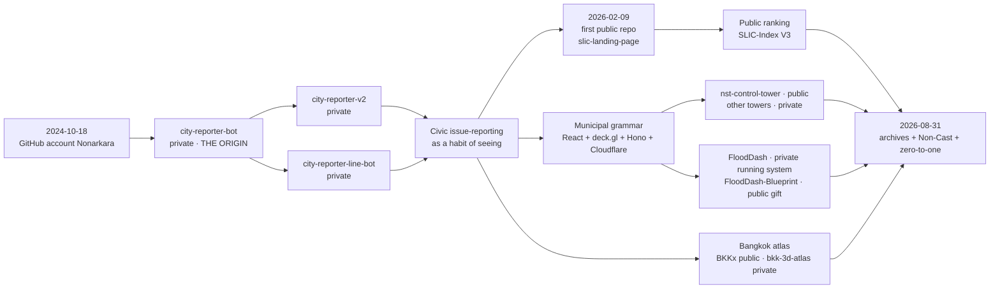

# From city reporter to studio

Private names below come only from the studio map that commissioned this history. The public API returns 404 for those slugs. Dates for private repos are **not** claimed.

