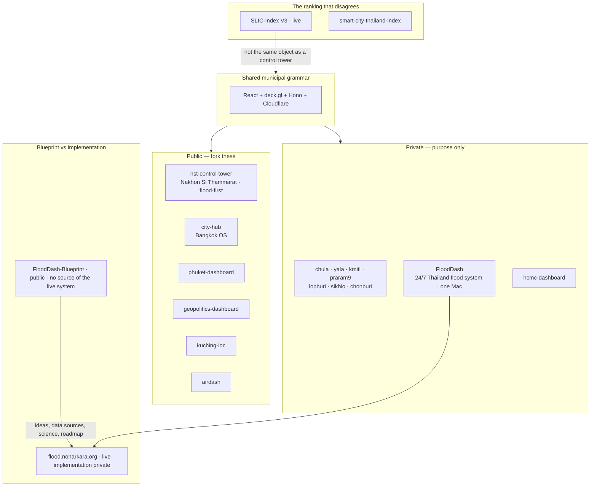

# Studio grammar

Municipal dashboards share one stack. SLIC is the public ranking that **disagrees** with how cities are usually scored. FloodDash-Blueprint is the gift; FloodDash is the running system.

