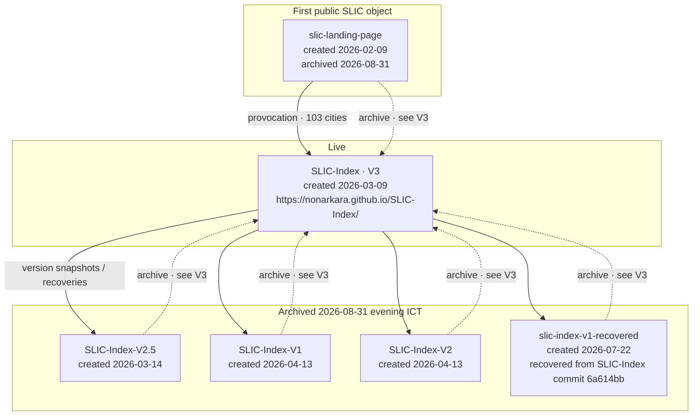

# SLIC lineage

GitHub `created_at` is when the **repository object** appeared, not always when that version first went public. V3 lives in [`SLIC-Index`](https://github.com/Nonarkara/SLIC-Index), created 2026-03-09 — earlier than the later-created V1/V2 archive repos. The landing page (2026-02-09) is the first public SLIC object on this account.

Public GitHub description of V3 at snapshot (quote, not a re-count):

> SLIC Index V3 — The city ranking that disagrees. 157 cities, 5 pillars, 35 signals, every score traceable. Not a ranking — a reality check. Launched at SCSE 2026 Taipei to 3,000 professionals. Open source, free, no paywall, no black box.
